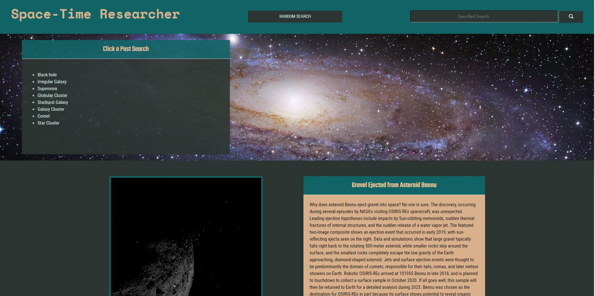

<!-- PROJECT INTRO -->
 

  

  <h3 align="center">JavaScript Quiiz</h3>

  

    An awesome Space-Time Researcher to help your students learn all about space!
     
    <a href="https://github.com/ChazzKreutzkamp/group-project-one-Group4/"><strong>Explore the docs »</strong></a>
     
     
    <a href="https://ChazzKreutzkamp.github.io/group-project-one-Group4/">View Demo</a>
    ·
    <a href="https://github.com/ChazzKreutzkamp/group-project-one-Group4/tree/issues">Report Bug</a>
    ·
    <a href="https://github.com/ChazzKreutzkamp/group-project-one-Group4/tree/issues">Request Feature</a>
  

<!-- TABLE OF CONTENTS -->
## Table of Contents

* [About the Project](#about-the-project)
  * [Built With](#built-with)
* [Getting Started](#getting-started)
* [Roadmap](#roadmap)

<!-- ABOUT THE PROJECT -->
## About The Project

Ignite a love of learning, science, and astronomy while your kids are still young! Utilize our web application to allow your students to learn all about space and astronomy in a safe environment. 

Here's why:
* The information on the world wide web truly is limitless today. And as amazing and rewarding as it is to have this plethora of information at our fingertips search engines like Google and Youtube present a very real threat to young students. 
* Our children deserve a safe space to learn and parents deserve peace of mind. 
* Using our Space-Time researcher you’ll be able to allow your kids to learn in a safe environment without setting your curious kids lose on the web. 

A list of commonly used resources that I find helpful are listed in the acknowledgements.

### Built With
* [JavaScript](https://javascript.com)
* [html](https://html.com)
* [css](https://free-css.com)
* [jQuery](https://api.jqueryui.com/)
* [uiKit](https://getuikit.com/)
* [Nasa](https://api.nasa.gov/)
* [Wikipedia](https://en.wikipedia.org/)
* [Youtube](https://developers.google.com/youtube/v3)

<!-- GETTING STARTED -->
## Getting Started

To get started simply enter the zip code for the city you wish to view the weather in. 

<!-- ROADMAP -->
## Roadmap

See the [open issues](https://github.com/heather-everton/Weather-Dashboard/issues) for a list of proposed features (and known issues).